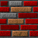
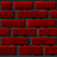
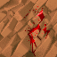
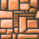
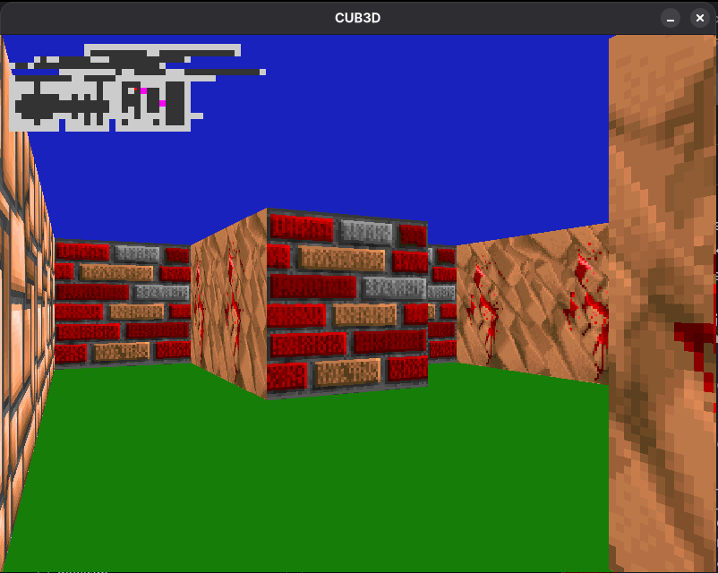
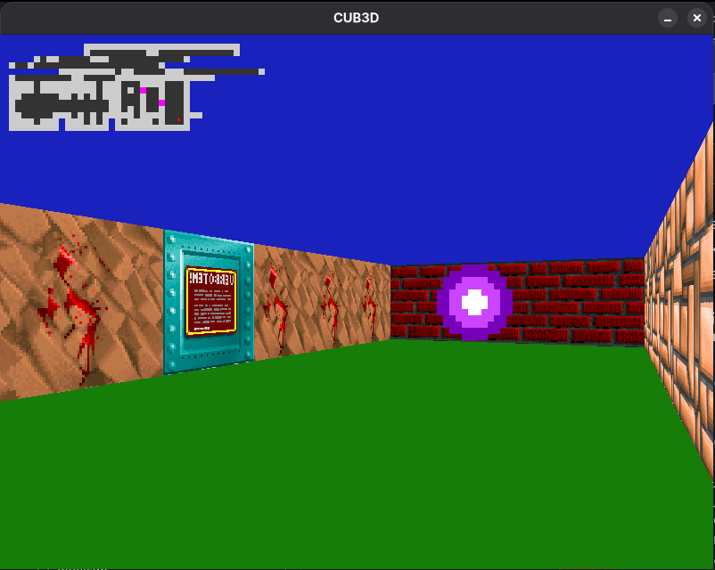

# cub3D

## 📖 About the Project
**cub3D** is a project from the 42 school curriculum inspired by the world-famous 90's game *Wolfenstein 3D*. The objective of this project is to create a dynamic 3D graphic representation of the inside of a maze from a 2D map, using the **Ray-Casting** principles. 

It is a fantastic deep dive into mathematics (trigonometry and vectors), algorithmic implementation (DDA algorithm), and graphics programming using the MiniLibX library.

## 🚀 Features

### Core Engine
* **Raycasting:** Smooth 3D rendering of walls using the Digital Differential Analysis (DDA) algorithm.
* **Texture Mapping:** Different textures assigned to the North, South, East, and West walls.
* **Color rendering:** Flat color rendering for the floor and ceiling based on RGB values provided in the configuration map.
* **Map Parsing:** Robust parsing of `.cub` files, handling map validation, player spawn orientation (N, S, E, W), and graphical configurations.

### Gameplay & Controls
* **Movement:** Walk forward, backward, and strafe left/right using `W`, `A`, `S`, `D`.
* **Camera:** Look left and right using the `<-` and `->` arrow keys.
* **Window Management:** Smooth window updating, closing via `ESC` key or the window's red cross.

### 🌟 Bonus Features
* **Minimap:** A real-time 2D minimap to help navigate the maze.
* **Mouse Control:** Look around smoothly using the mouse (pan left/right).
* **Doors:** Interactable elements within the maze (as indicated by `door.cub`).

## 🖼️ Textures & Visuals

Here is a look at the textures used in the game. *(Make sure to replace the image paths with your actual screenshot/texture paths!)*

### Wall Textures
| North Wall | South Wall | East Wall | West Wall | Door |

|  |  |  |  |  |

### In-Game Screenshots

*Description: A view from inside the maze, demonstrating raycasting and wall textures.*


*Description: Showcasing the minimap, floor/ceiling colored rendering and sprit.*

## 🛠️ Usage

### Compilation
The project includes a `Makefile` to compile both the mandatory and bonus parts using the `minilibx` graphics library.

```bash
# Compile the mandatory part
make

# Compile the bonus part (with minimap, mouse support, etc.)
make bonus

# Clean object files
make clean

# Clean everything including the executable
make fclean

# Clean object files bonus
make clean_bonus

#clean everything include the executable bonus
make fclean_bonus
```

### Running the Game
To run the game, you must provide a `.cub` scene description file as an argument. Several test files like `test.cub` or `door.cub` are available.

```bash
# Mandatory
./cub3D test.cub

# Bonus
./cub3D_bonus door.cub
```

### `.cub` Map Format Example
```text
NO ./texture/north.xpm
SO ./texture/south.xpm
WE ./texture/west.xpm
EA ./texture/east.xpm

F 220,100,0
C 225,30,0

111111
100001
10N001
111111
```

## 🧠 What I Learned
* **Raycasting Mathematics:** Understanding vectors, camera planes, rays, and how to calculate rendering distances to avoid fisheye effects.
* **DDA Algorithm:** Efficiently calculating ray intersections with a grid.
* **Graphics API:** Mastering `MiniLibX` for managing windows, native events, and pixel-by-pixel image manipulation (`mlx_pixel_put`).
* **Game Loop Management:** Handling real-time inputs tied to rendering and frame rates.
* **Advanced Parsing:** Validating closed maps (flood fill algorithm) and complex file structures.
